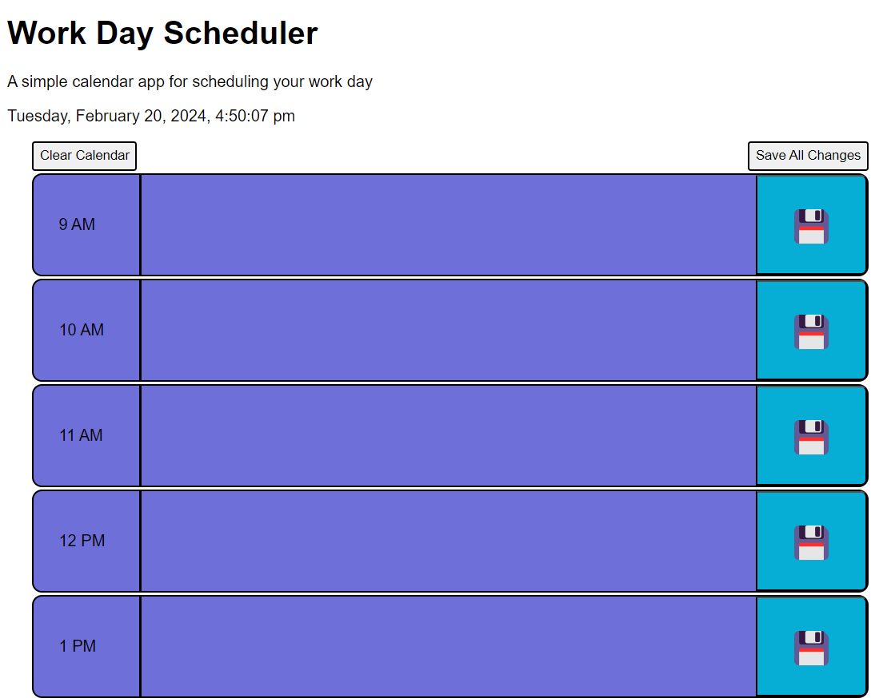

# Work Day Scheduler

## Description

This Work Day Scheduler was created to provide the user with a webpage to log notes and tasks in order to plan their day. The hours of the working day each have a dedicated row. These rows are color coded based on whether or not the hour has past, is the present hour, or is in the future. Each row has a save button to save the contents of the text area in that row, which are displayed on page load using local storage. Alternatively, the user can save multiple changes simply by clicking the "Save All Changes" button located at the top of the page. The user also has the ability to clear all entries by clicking the "Clear Calendar Button".

## Installation

N/A

## Usage

This webpage was created to provide the user with a place to store information about their day, get the current time, and plan the day ahead.

## Credits

This project was created using starter code from coding-boot-camp on GitHub. The repository for the starter code is crispy-octo-meme and features contributions from Xandromus, Georgeyoo, mfyke, and courtthecoop. Changes to the started code were performed solely by me.

## License

N/A

## Screenshots

## Link to Webpage

https://wshearin3.github.io/work-day-scheduler/